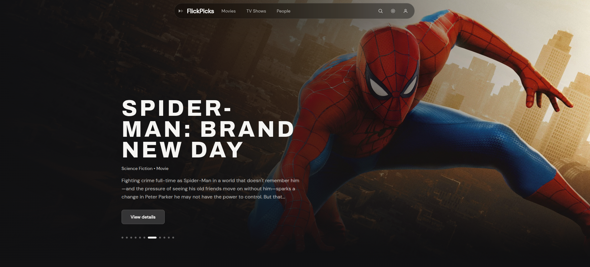
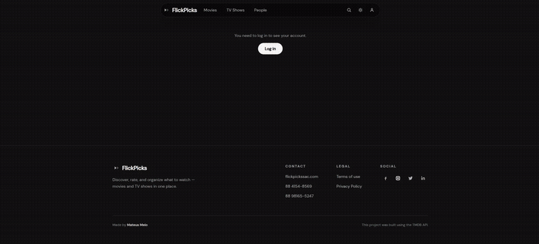
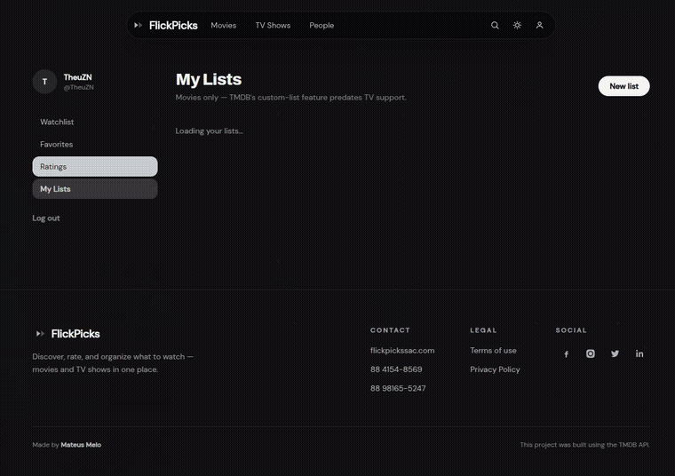
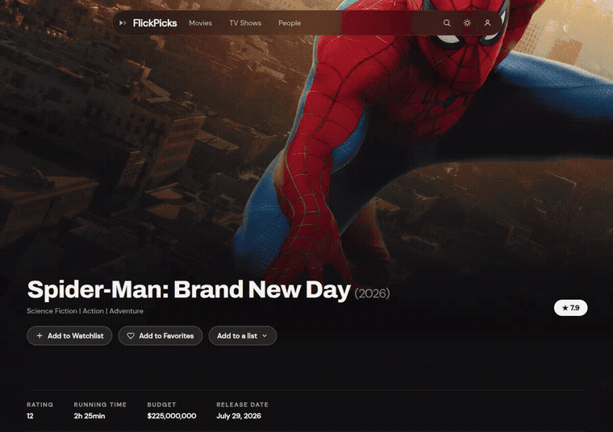

# FlickPicks

🇬🇧 [Read in English](README_EN.md)

Descubra, avalie e organize o que assistir — filmes e séries num só lugar, usando a API do [The Movie Database (TMDB)](https://www.themoviedb.org/).



## Sumário

- [Visão geral](#visão-geral)
- [Funcionalidades](#funcionalidades)
- [Stack técnica](#stack-técnica)
- [Como rodar](#como-rodar)
- [Variáveis de ambiente](#variáveis-de-ambiente)
- [Estrutura do projeto](#estrutura-do-projeto)
- [Limitações conhecidas](#limitações-conhecidas)
- [Próximos passos](#próximos-passos)
- [Como isso foi construído](#como-isso-foi-construído)
- [Atribuição](#atribuição)

## Visão geral

FlickPicks é um app de descoberta de filmes/séries feito com Angular 22 (standalone components, signals, change detection zoneless) e Tailwind CSS 4, consumindo a API da TMDB direto pelo cliente. É um projeto pessoal construído pra explorar as primitivas reativas mais novas do Angular (`signal`, `computed`, `httpResource`, `linkedSignal`) em cima de uma aplicação real, cheia de dado — não um CRUD de brinquedo.

O login é de verdade, não simulado: entrar usa o próprio fluxo de autenticação da TMDB, então a watchlist, os favoritos, as avaliações e as listas customizadas que você cria no FlickPicks são as mesmas da sua conta real na TMDB.

## Funcionalidades

### Descoberta
- **Home** — um carrossel rotativo de destaques em alta, um carrossel de gêneros pra filtrar, e fileiras com scroll horizontal (Latest, Popular, Top Rated, Dev List, Nerd List) com alternância entre Movies/TV Shows em cada uma.
- **Páginas de navegação** (`/movies`, `/tv`, `/people`) — grids paginados com "Load more", e filtros de Ordenação (Popularidade, Nota, Mais recentes, Mais antigos, Mais votados), Gênero, Onde Assistir (Netflix, Prime Video, Disney+, Max, Apple TV+) e Nota mínima.
- **Busca unificada** — uma barra de busca no header, resultados divididos por Movies / TV Shows / People, reaproveitando a mesma grade filtrada do Browse.
- **Quiz "Sem ideia do que assistir?"** — um quiz curto de várias etapas (humor, época, duração, streaming) que transforma suas respostas numa busca `discover` da TMDB e mostra uma indicação na hora.

### Detalhes de filme/série
- Página de detalhe completa: banner de fundo, pôster, gêneros, nota, duração, orçamento, data de lançamento, classificação indicativa (tenta BR primeiro, cai pra US).
- Créditos de direção/criação e roteiro, elenco completo linkando pro perfil de cada pessoa.
- Trailer (embed do YouTube que só carrega quando clicado — nada baixa sem pedir).
- Tagline mostrada como citação, quando a TMDB tem uma.
- Reviews, com a nota do próprio autor da review quando ele deixou uma.
- Galeria de imagens que abre num lightbox dentro da própria página (não numa aba nova).
- Fileira de "Relacionados" no final, reaproveitando o mesmo componente de fileira da home.

### Pessoas
- Perfil de pessoa: foto, biografia (com "leia mais"), informações pessoais (aniversário com idade calculada, local de nascimento, área de atuação), e redes sociais vindas do `external_ids` da TMDB (só aparecem quando a pessoa realmente tem).
- Fileira "Known For", ordenada pela própria métrica de popularidade da TMDB — a mesma lógica que o site oficial usa.

### Sua conta
- **Login real com a TMDB** — "Continue with TMDB" leva pelo fluxo oficial deles (token → aprovação → sessão). Não existe senha própria do FlickPicks.
- **Watchlist e Favoritos** — adiciona/remove direto da página de qualquer título; os botões já mostram o estado real salvo (via `account_states` da TMDB), não um chute.
- **Avaliações** — nota de 1 a 10 em qualquer título. Logado, é uma avaliação de verdade na TMDB; deslogado, ainda funciona como avaliação de convidado guardada no navegador, pra ninguém ficar impedido de testar.
- **Listas customizadas** — cria suas próprias listas, adiciona títulos a partir da página de detalhe, visualiza e apaga pelo painel da conta. (Só filme — ver [Limitações conhecidas](#limitações-conhecidas).)
- **Painel da conta** (`/account`) — sidebar fixa (avatar, nome, navegação) com Watchlist / Favorites / Ratings / My Lists como seções que trocam sem recarregar a página, cada remoção com diálogo de confirmação antes.

<details>
<summary><strong>Veja funcionando</strong> (sem precisar logar pra assistir)</summary>
<br>

**Login** — entrando com uma conta TMDB de verdade pelo fluxo oficial de autenticação:



**Listas customizadas** — criando uma lista, abrindo ela, removendo um título, apagando a lista:



**Avaliações** — avaliando um título como convidado, e depois vendo as notas salvas no painel:



</details>

### Interface
- **Tema claro e escuro**, alternável pelo header, respeitando a preferência do sistema operacional na primeira visita.
- Totalmente responsivo, até em telas pequenas — inclusive o painel da conta, que passa de lado-a-lado pra empilhado quando não sobra espaço pra sidebar e grid juntos.
- Fileiras com scroll horizontal usam scroll nativo com `scroll-snap` do CSS (pra clique nas setas e swipe sempre pararem na borda de um card, nunca no meio), mais setas e bolinhas de posição customizadas por cima.
- Estados de carregamento com skeleton e transições suaves ao trocar de aba, pra interface nunca piscar uma grade vazia.
- Todo dropdown (ordenar, gênero, "adicionar a uma lista", etc.) é um componente customizado, não um `<select>` nativo — assim ele realmente combina com o tema do app, em vez de usar o estilo padrão do navegador.

## Stack técnica

- **[Angular 22](https://angular.dev)** — standalone components, signals, `httpResource`, `linkedSignal`, change detection zoneless, o novo decorator `@Service()`, e control flow nativo (`@if`/`@for`).
- **[Tailwind CSS 4](https://tailwindcss.com)** — tema via CSS puro com `@theme`, sem arquivo de config separado.
- **[TMDB API v3](https://developer.themoviedb.org/docs)** — todo dado, busca, autenticação e ação de conta.

Sem backend próprio — é uma SPA que fala direto com a TMDB pelo lado do cliente.

## Como rodar

```bash
# 1. Clona
git clone https://github.com/seu-usuario/flickpicks.git
cd flickpicks

# 2. Instala (precisa de Node 22.22.3+, 24.15+ ou 26+)
npm install

# 3. Configura suas credenciais da TMDB
cp src/environments/environment.example.ts src/environments/environment.ts
cp src/environments/environment.example.ts src/environments/environment.development.ts
# depois cola seu token nos dois arquivos — ver abaixo

# 4. Roda
ng serve
```

Abre `http://localhost:4200`.

## Variáveis de ambiente

O FlickPicks precisa de um **API Read Access Token (v4 auth)** da TMDB — pega o seu de graça em [themoviedb.org/settings/api](https://www.themoviedb.org/settings/api).

```ts
// src/environments/environment.ts
export const environment = {
  linkUrl: 'https://api.themoviedb.org/3',
  linkImageUrl: 'https://image.tmdb.org/t/p/w500',
  acessToken: 'SEU_TOKEN_DE_ACESSO_DA_TMDB',
};
```

`environment.ts` e `environment.development.ts` estão no `.gitignore` — nunca comita seu token real. Usa o `environment.example.ts` como molde.

> **Atenção:** esse token vai pro bundle do navegador, igual qualquer app que fala direto com uma API de terceiro pelo cliente. O escopo dele é só leitura, então o risco prático é alguém consumir sua cota de uso, não tomar sua conta — mas se for publicar isso de verdade, vale considerar um proxy (função serverless na Vercel/Netlify/Cloudflare) que injeta o token do lado do servidor em vez do cliente.

## Estrutura do projeto

```
src/app/
├── pages/          # Páginas roteadas: home, browse, titledetail, persondetail, login, account*
├── components/      # Peças reutilizáveis: header, footer, hero, movieCard, movieRow, quiz, etc.
├── services/         # TmdbLists (leitura/escrita), AuthService (sessão), ThemeService
└── environments/      # Config da API (fora do Git, exceto o molde .example)
```

## Limitações conhecidas

- **Listas customizadas são só de filme.** O endpoint `/list` da TMDB é anterior ao suporte de série na API deles e nunca foi estendido — não é uma limitação do FlickPicks, é da API por baixo.
- **Ações de escrita (watchlist/favorito/avaliação) precisam de sessão válida e logada.** Não ficam disponíveis pra quem não está logado, exceto a avaliação, que cai pro modo convidado.
- **Avaliação de convidado não migra.** Se você avalia como convidado e depois loga, a TMDB não tem API pra juntar essa nota na sua conta real — ela continua separada, só local no seu navegador.

## Próximos passos

Ideias que ainda não existem, mais ou menos em ordem de quanto agregariam:
- Botão de "adicionar a uma lista" direto no Browse/busca, não só na página de detalhe.
- Rotas com lazy loading pra reduzir o bundle inicial.
- Uma opção de deploy com proxy pro token da API (ver aviso acima).

## Como isso foi construído

Esse projeto foi construído em colaboração com o **Claude Sonnet 5** (Anthropic). As decisões de produto foram minhas do início ao fim — o quiz de recomendação, a separação entre as fileiras curadas (Dev List/Nerd List) e a watchlist pessoal, o layout do painel da conta, e cada correção ao longo do caminho começou de algo que eu percebi e direcionei, muitas vezes a partir de um print ou gravação de tela de um bug real. O Claude escreveu e ajustou o código sob essa direção, conferindo cada mudança contra um build de verdade antes de entregar.

## Atribuição

Este produto usa a API da TMDB, mas não é endossado ou certificado pela TMDB.

Feito por Mateus Melo.